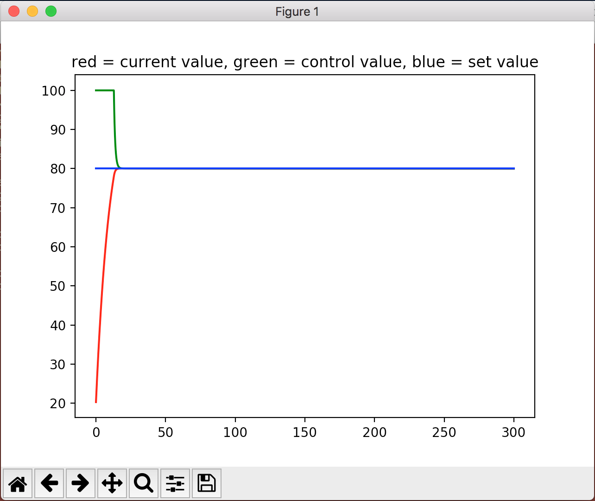

# PID controller

A PID controller operating on a model corresponding to an object being heated.

## Heating model

The model calculates the temperature of the object based on the objects current temperature and the control temperature (ambient temperature).

Model variables:

* T1 = object temperature
* T2 = ambient temperature (control temperature)
* k = coefficient
* dt = delta time between each time a new temperature is calculated

    dT1/dt = k * (T2 - T1)

## PID controller

The PID controller calculates proportional error, integral error and derivative error. Based on those errors it calculates a new control value (ambient value) using proporital (kp), integral (ki) and derivative (kd) coefficients.

The PID controller implements a min/max limit on its control value.

## How to run

    pip3 install matplotlib
    python3 pidcontroller.py

A graph will be shown with a plot of temperature, control temperature and goal temperature.

